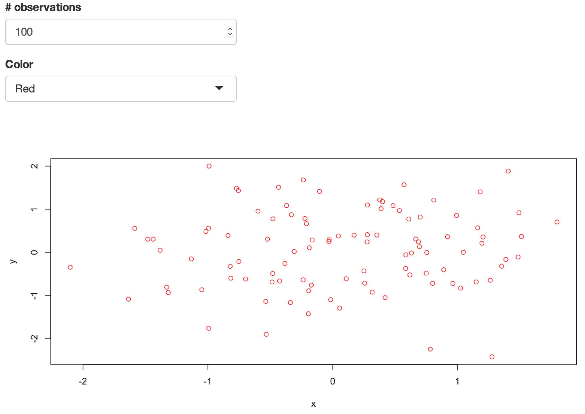

# Exercise-2

In this exercise, you'll build a simple Shiny application that can
communicate between a server and a user-interface. The final product
will be a scatterplot in which you can select the number of
observations and the color (using shiny widgets):



We suggest you use the following functions:

* create `x` and `y` as random numbers like this:
```r
x <- rnorm(100)  # 100 random numbers
```
* plot data with color using base R plotting:
```r
plot(x, y, col="red")
```
  We recommend you to first be able to create an x-y scatterplot out
  of random numbers, and thereafter put this into a shiny server.
* Use slider (`sliderInput`) or number entry box (`numericInput`) to enter a number
* Use menu (`selectInput`) to select color

Check also out [shiny widget gallery](http://shiny.rstudio.com/gallery/widget-gallery.html)
with code snippets included.

As in previous exercises, you should fork and clone this repository,
follow the instructions in the `ui.R` and `server.R` files, then `add`
and `commit` your changes so that you can `push` them back up to
GitHub.
